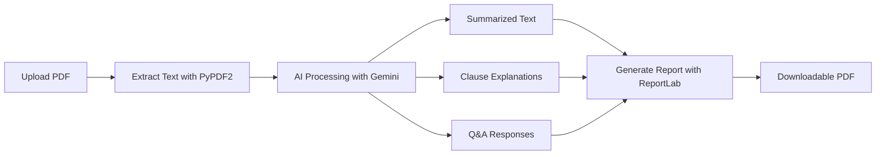

# 📘 LegalEaseAI – Demystifying Legal Documents with Generative AI

🚀 **LegalEaseAI** is a prototype built for **GenAI Exchange Hackathon 2025**.
It leverages **Google Gemini AI** to simplify complex legal documents, explain clauses, answer user queries, and generate professional reports.

---

## ✨ Features

* 📂 **Upload Legal PDFs** → Upload any contract, agreement, or policy document.
* 📝 **Simplified Summaries** → Get plain-language summaries of complex legal text.
* 📑 **Clause Explanations** → Detailed explanations of important legal clauses.
* 💬 **Interactive Q\&A** → Ask custom questions about the document and receive AI-powered answers.
* 📘 **Professional Report Generation** → Auto-generate branded PDF reports with logo, timestamp, and disclaimer.
* 🔄 **Multi-API Key Rotation** → Ensures uninterrupted AI service even if quota limits are hit.

---

## 🔎 Problem Statement

Legal documents are often **lengthy, jargon-filled, and inaccessible** to common people.
Hiring legal experts is **expensive and time-consuming**, while existing tools only provide **OCR or keyword search**.

---

## 💡 Our Solution

LegalEaseAI simplifies legal knowledge by:

* Converting jargon into **easy-to-understand language**
* Providing **clause-by-clause breakdowns**
* Answering **user-specific queries** instantly
* Generating **professional PDF reports** ready to share

---

## 🛠️ Tech Stack

* **Frontend/UI:** [Streamlit](https://streamlit.io/)
* **AI Engine:** [Google Gemini 1.5 Flash](https://ai.google.dev/)
* **Document Processing:** PyPDF2, ReportLab
* **Programming Language:** Python 3.10+
* **Deployment:** Streamlit Cloud / Local Hosting

---

## ⚙️ Installation & Setup

### 🔹 Clone the Repository

```bash
git clone https://github.com/shivamkumar9811/legal-ai-prototype.git
cd legal-ai-prototype
```

### 🔹 Install Dependencies

```bash
pip install -r requirements.txt
```

### 🔹 Add API Keys

Add your Google Gemini API keys in `.streamlit/secrets.toml`:

```toml
GOOGLE_API_KEY_1 = "your_api_key_1"
GOOGLE_API_KEY_2 = "your_api_key_2"
GOOGLE_API_KEY_3 = "your_api_key_3"
```

### 🔹 Run the App

```bash
streamlit run app.py
```

---

## 📂 Project Workflow



---

## ⚠️ Disclaimer

This prototype is intended for **educational and informational purposes only**.
It does **not provide legal advice**. For professional legal matters, always consult a qualified legal expert.

---

## 👥 Team

* **Team Name:** LexiGen3
* **Team Lead:** Shivam Kumar
* **Hackathon:** GenAI Exchange Hackathon 2025

---

## 🚀 Future Enhancements

* Multi-language legal document support
* Integration with legal databases
* Improved clause detection with fine-tuned models
* Mobile app version.
